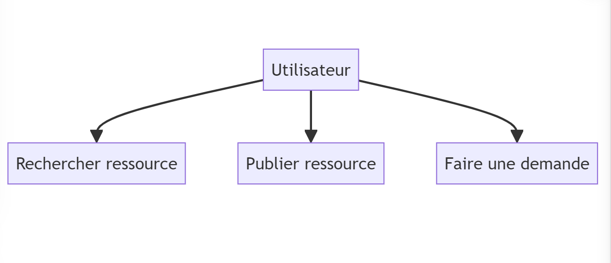
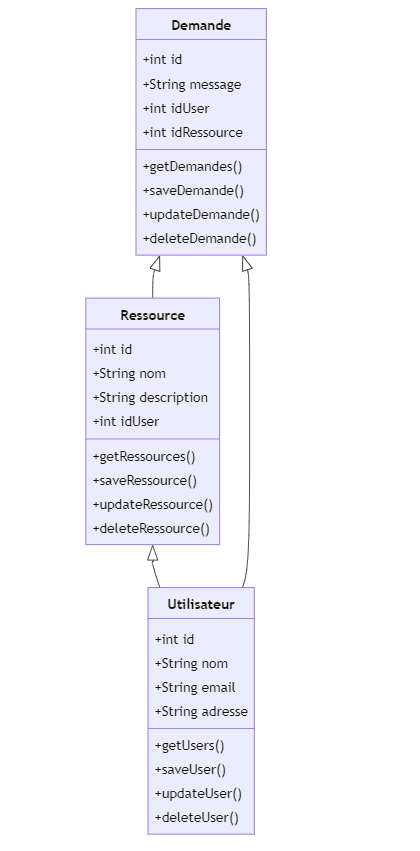
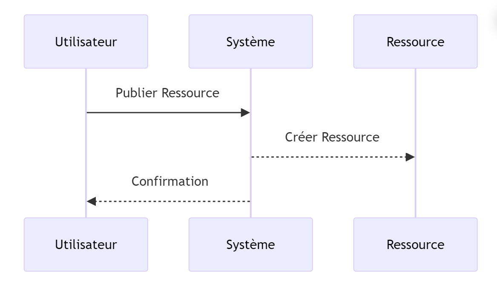
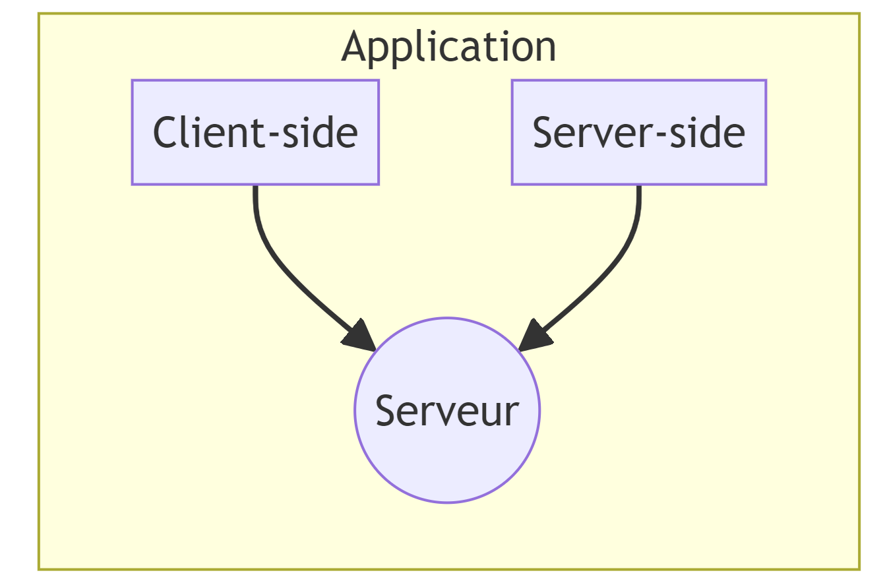

# Analyse UML de Partage+ 📊

## 1. Diagramme de cas d'utilisation 🔄

Le diagramme de cas d'utilisation présente les interactions entre les acteurs (utilisateurs) et le système Partage+.
| Utilisateur          |
|----------------------|
| - Rechercher ressource |
| - Publier ressource    |
| - Faire une demande    |

## 2. Diagramme de classes 📚

Le diagramme de classes représente les différentes classes du système et leurs relations.

| Utilisateur       | Ressource         | Demande         |
|-------------------|-------------------|-----------------|
| - id: int         | - id: int         | - id: int       |
| - nom: string     | - nom: string     | - utilisateur: Utilisateur |
| - email: string   | - description: string | - ressource: Ressource |
| - adresse: string| - proprietaire: Utilisateur | - message: string |

## 3. Diagramme de séquence 📈

Le diagramme de séquence illustre les interactions entre les objets du système dans un scénario donné.

>Utilisateur -> Système: Publier Ressource
>Système --> Ressource: Créer Ressource
>Système --> Utilisateur: Confirmation

## 4. Diagramme de déploiement 🌐

Le diagramme de déploiement montre comment les différents composants logiciels sont déployés sur le matériel physique.

